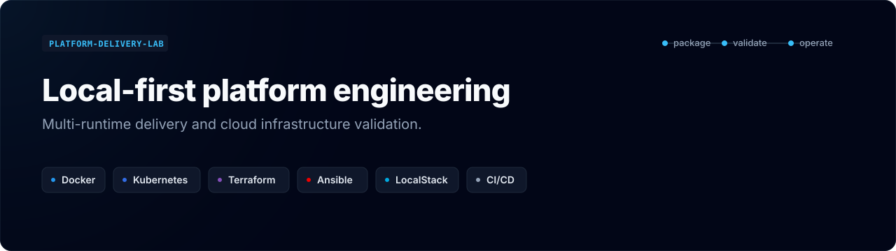
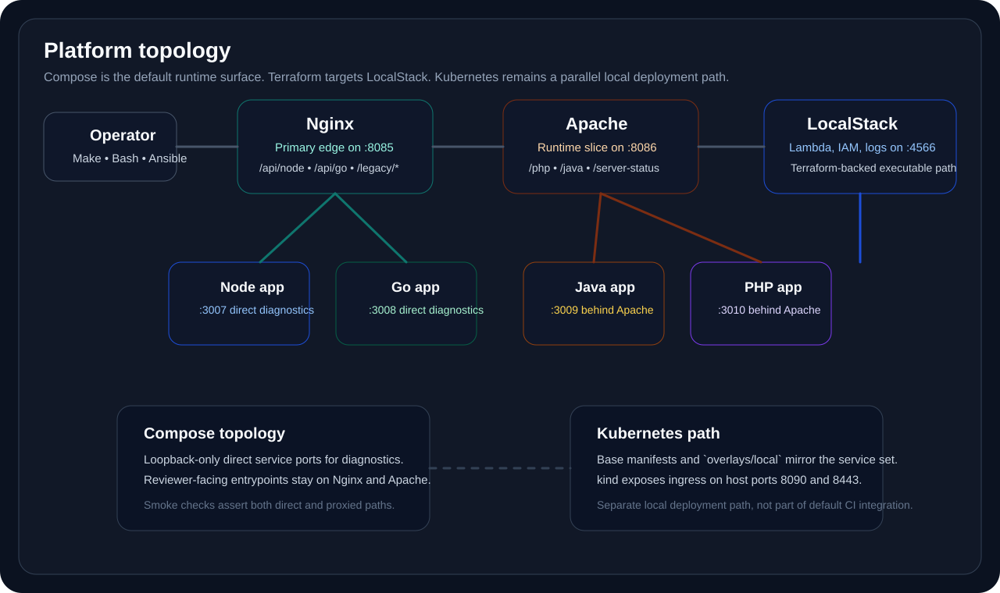
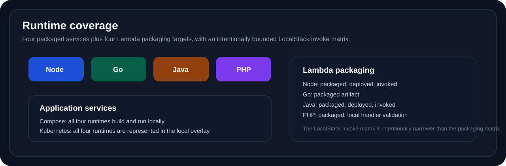

# platform-delivery-lab

<p align="center">
  
</p>

<p align="center">
  A local-first platform engineering lab for packaging, routing, validating, and operating multi-runtime services and Lambda workloads without relying on paid cloud accounts.
</p>

## Quick Navigation

- [Why It Matters](#why-it-matters)
- [Platform Topology](#platform-topology)
- [Capability Matrix](#capability-matrix)
- [Runtime Coverage](#runtime-coverage)
- [Local Workflow](#local-workflow)
- [CI/CD](#cicd)
- [Repository Structure](#repository-structure)
- [Docs Map](#docs-map)
- [Scope Boundaries](#scope-boundaries)
- [Future Improvements](#future-improvements)

## Why It Matters

`platform-delivery-lab` is built to show one coherent platform story rather than a loose collection of tools. The repository demonstrates how to:

- package four application runtimes behind a clean local platform boundary
- route traffic intentionally with both Nginx and Apache
- validate a Kubernetes path without pretending to ship managed-cloud infrastructure
- structure Terraform so the executable path is real and the reference paths are still reviewable
- automate the operator workflow with Bash, Make, Ansible, GitHub Actions, and Azure DevOps
- package Lambda workloads across Node.js, Go, Java, and PHP through a LocalStack-first contract

The result is a portfolio repository that reads like a compact internal platform lab: opinionated, runnable, and easy to audit.

## Platform Topology

<p align="center">
  
</p>

The Docker Compose stack is the default execution surface. Nginx is the primary edge on `:8085`, Apache owns the Java and PHP slice on `:8086`, and the four services remain directly reachable on loopback-only ports for diagnostics and smoke validation. LocalStack runs on `:4566` and is the executable serverless control plane for the Terraform path.

| Layer | Components | Responsibility |
| --- | --- | --- |
| Edge | Nginx | Default entrypoint, Node and Go routing, Apache diagnostics passthrough |
| Runtime slice | Apache | Java and PHP routing, legacy path handling, `server-status` diagnostics |
| Services | Node.js/TypeScript, Go, Java, PHP | Shared `/healthz` and `/status` contract across four runtimes |
| Serverless | LocalStack, Terraform | Local Lambda/IAM/logs path without paid AWS usage |
| Automation | Make, Bash, Ansible | Operator entrypoints, bootstrap, validation, packaging |
| Delivery | GitHub Actions, Azure DevOps | Validation parity for the same local-first workflow |
| Kubernetes path | kind, Kustomize, ingress | Reviewable local cluster path aligned to the runtime topology |

## Capability Matrix

| Capability | Implementation path | Primary entrypoint | Validation signal |
| --- | --- | --- | --- |
| Docker runtime | [docker-compose.yml](docker-compose.yml) | `make up` | Service healthchecks and `make smoke` |
| Reverse proxy routing | [docker/nginx/default.conf](docker/nginx/default.conf), [docker/apache/vhosts/default.conf](docker/apache/vhosts/default.conf) | `make smoke` | Direct and proxied endpoint assertions |
| Kubernetes path | [k8s/](k8s) | `make k8s-validate`, `make k8s-apply` | Kustomize render validation and kind apply path |
| Terraform path | [infra/terraform/localstack](infra/terraform/localstack) | `make tf-validate`, `make tf-apply-localstack` | Executable LocalStack provider flow |
| Ansible automation | [ansible/](ansible) | `make ansible-check`, `make ansible-run` | Syntax checks and bootstrap workflow |
| Lambda packaging | [lambdas/](lambdas) | `make lambda-package` | Multi-runtime artifacts under `dist/lambdas/` |
| GitHub Actions CI | [.github/workflows/ci.yml](.github/workflows/ci.yml) | Push / PR validation | Split `validate` and `integration` jobs |
| Azure DevOps pipeline | [azure-pipelines.yml](azure-pipelines.yml) | Push / PR validation | Matching validation and integration stages |
| Smoke and validation workflows | [scripts/](scripts) | `make validate`, `make smoke`, `make lambda-smoke` | Bash-driven contract checks |

## Runtime Coverage

<p align="center">
  
</p>

| Workload | Runtime | Location | Default local path | Routed path | Kubernetes path | LocalStack status |
| --- | --- | --- | --- | --- | --- | --- |
| Application service | Node.js / TypeScript | `apps/node-ts` | `127.0.0.1:3007` | `:8085/api/node/*` | Yes | Not applicable |
| Application service | Go | `apps/go` | `127.0.0.1:3008` | `:8085/api/go/*` | Yes | Not applicable |
| Application service | Java | `apps/java` | `127.0.0.1:3009` | `:8086/java/*`, `:8085/legacy/java/*` | Yes | Not applicable |
| Application service | PHP | `apps/php` | `127.0.0.1:3010` | `:8086/php/*`, `:8085/legacy/php/*` | Yes | Not applicable |
| Lambda package | Node.js / TypeScript | `lambdas/node-ts` | `dist/lambdas/node-ts/function.zip` | Not applicable | Not applicable | Deployed and invoked |
| Lambda package | Go | `lambdas/go` | `dist/lambdas/go/function.zip` | Not applicable | Not applicable | Packaged only |
| Lambda package | Java | `lambdas/java` | `dist/lambdas/java/function.zip` | Not applicable | Not applicable | Deployed and invoked |
| Lambda package | PHP | `lambdas/php` | `dist/lambdas/php/function.zip` | Not applicable | Not applicable | Packaged with local handler validation |

## Local Workflow

### Quick Start

```bash
make bootstrap
make up
make smoke
make lambda-package
make tf-apply-localstack
make lambda-smoke
```

### Core Operator Targets

| Target | Purpose |
| --- | --- |
| `make validate` | Full repository validation suite without starting the runtime stack |
| `make up` | Build and start the Compose platform |
| `make smoke` | Verify direct services, routed services, and proxy diagnostics |
| `make k8s-validate` | Render and validate the local Kubernetes overlay |
| `make tf-validate` | Validate the executable LocalStack Terraform stack |
| `make tf-apply-localstack` | Apply the LocalStack Terraform stack |
| `make ansible-run` | Execute workspace bootstrap and repository contract checks |
| `make clean` | Remove generated artifacts and temporary state |

### Validation Flow

```bash
make validate
make up
make smoke
make tf-apply-localstack
make lambda-smoke
make down
```

The repository is designed so the local operator flow and the CI flow follow the same sequence and the same control scripts.

## CI/CD

<p align="center">
  
</p>

The repository uses two CI definitions with matching intent:

| System | Role | What it validates |
| --- | --- | --- |
| GitHub Actions | Default repository validation and integration flow for PRs and pushes | `make validate`, Compose startup, smoke checks, LocalStack Terraform apply, Lambda smoke |
| Azure DevOps | Equivalent validation path in a second delivery system | Static validation stage plus Compose and LocalStack integration stage |

Neither pipeline deploys to AWS, Azure, GCP, or a managed Kubernetes platform. Both pipelines stand up an ephemeral local platform inside the CI runner, validate it, and tear it back down.

## Repository Structure

```text
.
|-- apps/                  # Node.js, Go, Java, and PHP demo services
|-- ansible/               # Inventory, variables, bootstrap, and validation playbooks
|-- assets/readme/         # README SVG assets and diagrams
|-- docker/                # Nginx and Apache configuration
|-- docs/                  # Architecture, workflows, topology, runbooks, boundaries
|-- infra/localstack/      # LocalStack ready hooks
|-- infra/terraform/       # Executable LocalStack stack and cloud reference layouts
|-- k8s/                   # Base manifests, local overlay, and kind cluster config
|-- lambdas/               # Multi-runtime Lambda sources
|-- scripts/               # Bash automation and validation entrypoints
|-- .github/workflows/     # GitHub Actions validation flow
|-- azure-pipelines.yml    # Azure DevOps validation flow
|-- docker-compose.yml     # Local runtime topology
`-- Makefile               # Primary operator interface
```

## Docs Map

| Document | Focus |
| --- | --- |
| [docs/quickstart.md](docs/quickstart.md) | Fast local bring-up and validation path |
| [docs/architecture.md](docs/architecture.md) | Core design decisions and platform boundaries |
| [docs/topology.md](docs/topology.md) | Service map, route ownership, and exposed surfaces |
| [docs/reverse-proxy.md](docs/reverse-proxy.md) | Nginx and Apache routing model |
| [docs/deployment-flow.md](docs/deployment-flow.md) | Local runtime, LocalStack, Kubernetes, and CI flows |
| [docs/kubernetes.md](docs/kubernetes.md) | kind-oriented Kubernetes structure and commands |
| [docs/terraform.md](docs/terraform.md) | Executable LocalStack Terraform path and reference layouts |
| [docs/ansible.md](docs/ansible.md) | Bootstrap automation and repository contract checks |
| [docs/localstack-lambda.md](docs/localstack-lambda.md) | Lambda packaging and LocalStack deployment model |
| [docs/ci-cd.md](docs/ci-cd.md) | GitHub Actions and Azure DevOps roles |
| [docs/runbooks.md](docs/runbooks.md) | Operational troubleshooting commands |
| [docs/security.md](docs/security.md) | Local-first security posture and handling rules |
| [docs/roadmap.md](docs/roadmap.md) | Realistic next improvements |

## Scope Boundaries

- The repository is local-first and portfolio-oriented by design.
- LocalStack is the executable serverless path; it replaces paid AWS resources for the default workflow.
- The AWS, Azure, and GCP Terraform directories are reference layouts, not claimed live environments.
- Kubernetes support is aimed at kind and local manifest review, not managed-cluster operations.
- The default LocalStack invoke path covers Node and Java. Go and PHP stay in the packaging story without claiming a wider runtime matrix than the local environment reliably supports.

## Future Improvements

- Add policy validation for Terraform and Kubernetes resources
- Add image signing and SBOM generation to the CI flow
- Add optional host-specific execution profiles for the packaged-only Go and PHP Lambda artifacts
- Add lightweight observability examples that remain local-first
