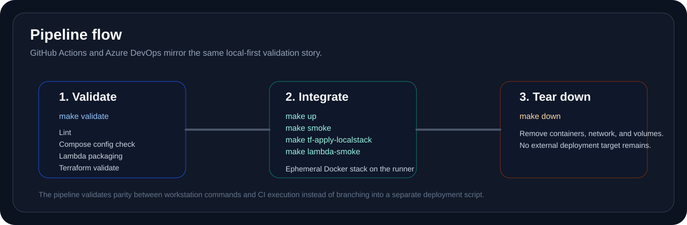

# CI/CD

## Overview

The repository uses two CI systems, both aligned to the same local-first workflow. Neither pipeline is a production deployment pipeline. Both are validation and integration pipelines for an ephemeral runtime environment inside the CI runner.

## GitHub Actions

`.github/workflows/ci.yml` is split into:

- `validate`
- `integration`

The `validate` job runs `make validate`. The `integration` job starts the Compose stack, runs smoke checks, applies the LocalStack Terraform stack, invokes Lambda functions, and tears the environment down.

## Azure DevOps

`azure-pipelines.yml` mirrors the same intent with two stages:

- `Validate`
- `Integration`

That keeps the repository presentation strong across both ecosystems without inventing a separate workflow model for each CI provider.

## Validation parity

| Area | Local command | CI coverage |
| --- | --- | --- |
| Shell and repo validation | `make validate` | GitHub `validate`, Azure `Validate` |
| Compose runtime startup | `make up` | GitHub `integration`, Azure `Integration` |
| Routed smoke checks | `make smoke` | GitHub `integration`, Azure `Integration` |
| LocalStack Terraform apply | `make tf-apply-localstack` | GitHub `integration`, Azure `Integration` |
| Lambda smoke | `make lambda-smoke` | GitHub `integration`, Azure `Integration` |

## Where CI deploys

The integration flow deploys only to the local runtime surfaces inside the hosted runner:

- Docker containers in the runner's Docker engine
- LocalStack resources exposed by the LocalStack container

It does not deploy to AWS, Azure, GCP, or a hosted Kubernetes cluster.

## Related documents

- [deployment-flow.md](deployment-flow.md)
- [terraform.md](terraform.md)
- [quickstart.md](quickstart.md)
