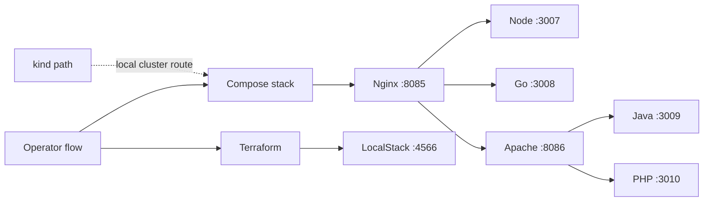

# Topology

## Overview

The runtime topology has two primary characteristics:

- Docker Compose is the default platform surface.
- Traffic flows through one deliberate proxy chain: Nginx at the edge, Apache for the Java and PHP slice.

## Service map

| Component | Runtime / role | Internal port | Host port | Notes |
| --- | --- | --- | --- | --- |
| `node-app` | Node.js / TypeScript | `3007` | `3007` | Direct diagnostics and Nginx upstream |
| `go-app` | Go | `3008` | `3008` | Direct diagnostics and Nginx upstream |
| `java-app` | Java 11 | `3009` | `3009` | Direct diagnostics and Apache upstream |
| `php-app` | PHP 8.3 | `3010` | `3010` | Direct diagnostics and Apache upstream |
| `nginx` | Primary edge | `80` | `8085` | Reviewer-facing default entrypoint |
| `apache` | Runtime slice proxy | `80` | `8086` | Java, PHP, and proxy diagnostics |
| `localstack` | Local AWS API emulator | `4566` | `4566` | Lambda, IAM, logs, and S3 services |

## Route ownership

| Route family | First owner | Upstream |
| --- | --- | --- |
| `/api/node/*` | Nginx | `node-app` |
| `/api/go/*` | Nginx | `go-app` |
| `/legacy/php/*` | Nginx | Apache, then `php-app` |
| `/legacy/java/*` | Nginx | Apache, then `java-app` |
| `/diagnostics/apache-status` | Nginx | Apache `server-status` |
| `/php/*` | Apache | `php-app` |
| `/java/*` | Apache | `java-app` |
| `/server-status` | Apache | Apache mod_status |

## Kubernetes mirror

The Kubernetes path mirrors the service set, not the full proxy chain. The local overlay contains:

- one namespace
- one shared `ConfigMap`
- one demo `Secret`
- four deployments
- four services
- one ingress

For kind, ingress is exposed through host port `8090` for HTTP and `8443` for HTTPS.

## Operational surfaces

| Surface | Purpose |
| --- | --- |
| Direct service ports | Runtime diagnostics and fast smoke assertions |
| Nginx | Main local reviewer entrypoint |
| Apache | Runtime slice review and diagnostics |
| LocalStack | Serverless control plane for Terraform and Lambda smoke tests |
| kind ingress | Local cluster routing path when running Kubernetes |

## Related documents

- [architecture.md](architecture.md)
- [reverse-proxy.md](reverse-proxy.md)
- [kubernetes.md](kubernetes.md)
- [localstack-lambda.md](localstack-lambda.md)
